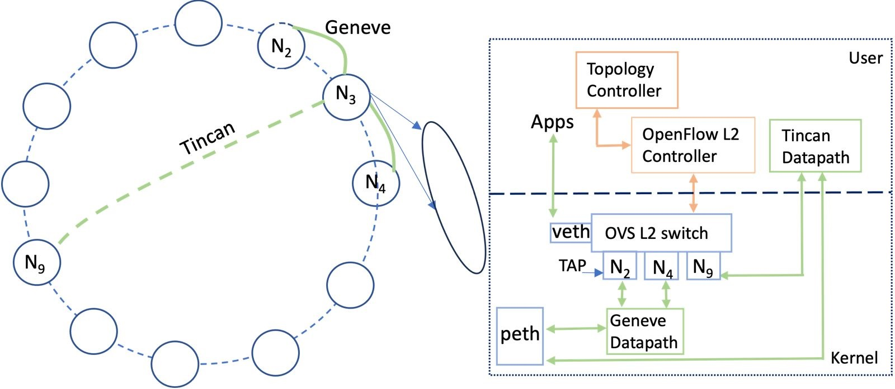

# Summary

The advent of virtualization and cloud computing has fundamentally changed how distributed applications and services are deployed and managed. With the proliferation of IoT and mobile devices, virtualized systems akin to those offered by cloud providers are increasingly needed geographically near the network’s edge to perform processing tasks in proximity to the data sources and sinks. Latency-sensitive, bandwidth-intensive applications can be decomposed into workflows that leverage resources at the edge – a model referred to as fog computing. Not only is performance important, but a trustworthy network is fundamental to guaranteeing privacy and integrity at the network layer. This paper describes `EdgeVPN.io` [@subratie_edgevpn_2023], a novel technique that enables virtual private Ethernet networks that span edge and cloud resources – including those constrained by NAT and firewall. `EdgeVPN.io` builds upon a scalable structured peer-to-peer overlay, and is novel in how it integrates overlay tunnels with SDN software switches to create a virtual network with dynamic membership – supporting unmodified Ethernet/IP stacks to facilitate the deployment of edge applications. `EdgeVPN.io` has been implemented as an open-source virtual network software solution, and experiments with the software have demonstrated its functionality and scalability. 

# Statement of need

Emerging IoT and smart spaces applications exhibit requirements that are difficult to meet using existing cloud computing models [5]. These appications can leverage lightweight data centers distributed across the network’s edge as processing nodes to bring compute and short-term storage closer to the data sources and sinks. This eliminates the latency and throughput penalties incurred from moving data across large geographic distances and through high contention, bandwidth-limited links. However, it introduces an operation and management problem: it is necessary to interconnect all widely distributed components to create a virtualized computing environment. Unfortunately, software and methodologies designed for the data center are typically poorly suited for fog computing operations along the Internet’s edge due to constraints of the Internet Protocol (IP).
Network virtualization stands at a unique point to address these challenges. While existing Virtual Private Networks (VPNs) can mitigate hurdles such as endpoint addressing and secure communication, current models are infeasible for operation and management at the proposed scale of future IoT applications. A decentralized, scalable system that supports dynamic membership, virtualizes addressable endpoints and provides secure communication such as `EdgeVPN.io` is needed. 

A illusrative use case of `EdgeVPN.io` is a software service that improves safety and effectiveness during multi-agency emergency response operations by enabling data-driven strategic and tactical decision-making. The networking core, along with web services and applications facilitate the definition, deployemnt and creation of ad hoc overlay networks. These virtual networks will span multiple organizations collaborating towards a specific goal, regardless of their location, proving the necessary connectivity and condidentiality for intra-group communication across the public Internet. `EdgeVPN.io` virtual response network aggregates and integrates heterogeneous resources such as IoT sensors and actuators, analytic compute engines, and operation personnel via their client devices (tablets, laptops, phones, etc.) across multiple organizations' networks for seamless connectivity and interactions.

`EdgeVPN.io` allows existing smart resources to be aggregated, securely accessed, and utilized in novel ways.

# Features

Multiple independent layer 2 overlays for zero trust.  
Hybrid overlays supporting native Tincan and Geneve tunnels.  
Self assembling and maintaining overlays.   
Dynamic membership - switching nodes can leave and join an overlay.
Multiple roles - a node can participate in an overlay as a switch or as a pendant device anchored to a switching node.  
Tincan tunnels are encrytped and support ICE bootstrapping via WebRTC data channel. Each Tincan tunnel runs in its own process.  
Geneve tunnels provide low latency communications with lower overheads.  

# Design

The goal of `EdgeVPN.io` is to deliver scalable layer 2 forwarding for dynamic edge and cloud network environments where the peer nodes act as software-defined bridges. `EdgeVPN.io` integrates a Symphony (1-D Kleinberg routable small-world network [@manku_symphony:_2003]) topology and a decentralized SDN-enabled layer-2 switching fabric. Each node runs two major modules \autoref{fig:sysov}: (1) the topology controller creates and maintains the overlay, while (2) the Openflow layer 2 controller programs the corresponding switching rules. Each peer node runs the same software with the same functional capabilities and independently maintains its controllers. While there are no centralized components for overlay management and SDN-programmed switching, it uses XMPP [@] for peer authentication and messaging, and ICE[@] for endpoint discovery and tunnel bootstrapping.

# Source Code and Packaging
`EdgeVPN.io` is available as an MIT-licensed opensourced project at https://github.com/EdgeVPNio. The two primary repos are EdgeVPNio/Controllers and EdgeVPNio/tincan. The SDN controllers maintain the node-local topology and Openflow-based layer 2 switching rules. They are implemented in Python and layer 2 switching, via the BoundedFlood module, is built on the Ryu framework.

Tincan is the `EdgeVPN.io` native datapath. It is implemented in C++ and creates the fundamental tunnel abstraction consisting of a Linux TAP device and a WebRTC data link. Tincan requires WebRTC source code or prebuilt libraies for compiling. The tools repo provide several scripts that assist with the builing and packaging process. Additionally both repos include `devcontainer` entries.

`EdgeVPN.io` releases are distributed as a Debian Package (a file with the .deb extention) and hosted on public server for installation via `apt-get`. A ready-to-run docker image is also hosted publicly for retrival using `docker pull`.

# Acknowledgements

This material is based upon work supported by the National Science Foundation, USA under Grants OAC-2004441, OAC-2004323, and CNS-1951816. Any opinions, findings, and conclusions or recommendations expressed in this material are those of the author(s) and do not necessarily reflect the views of the National Science Foundation.

# References